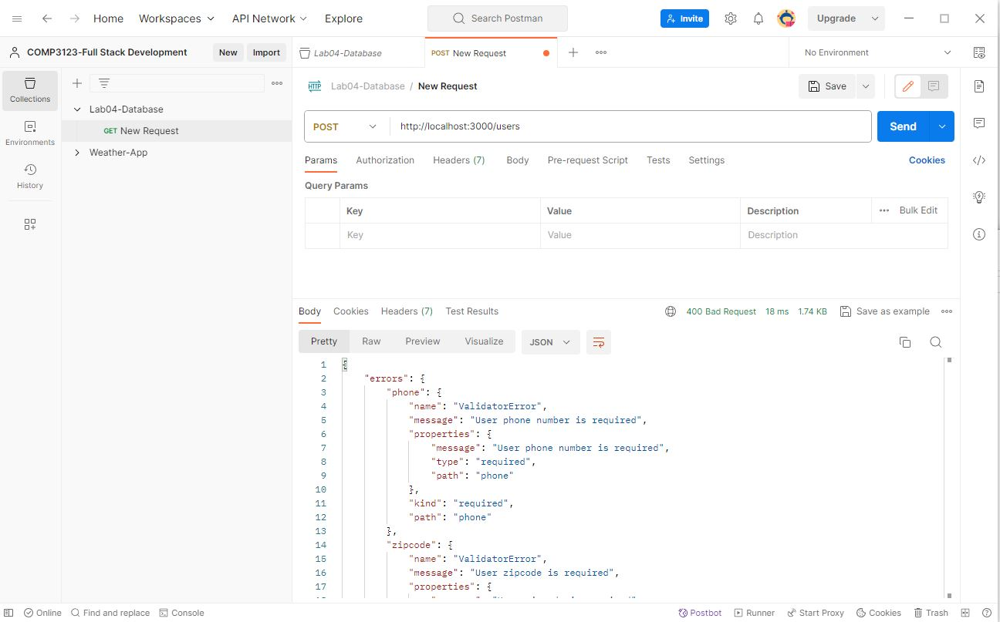
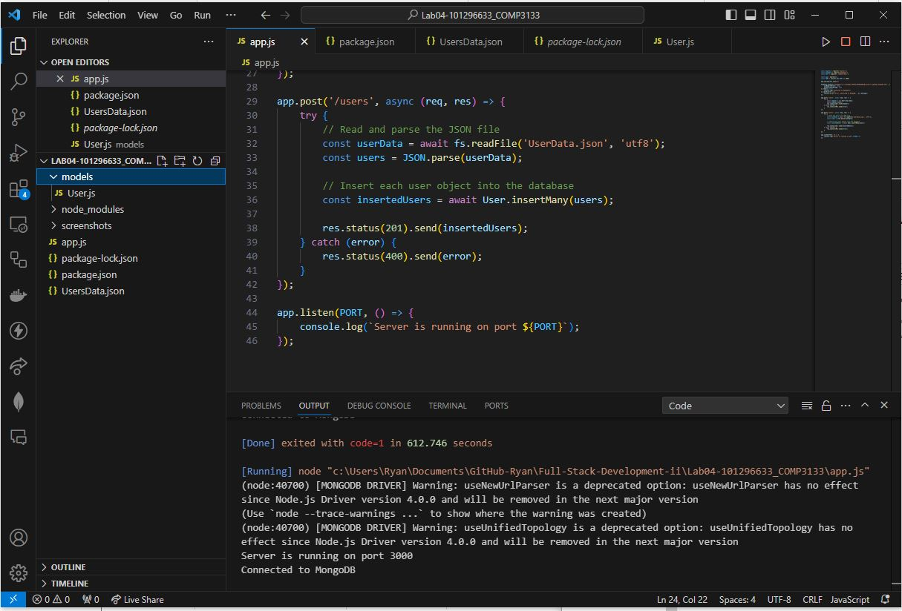
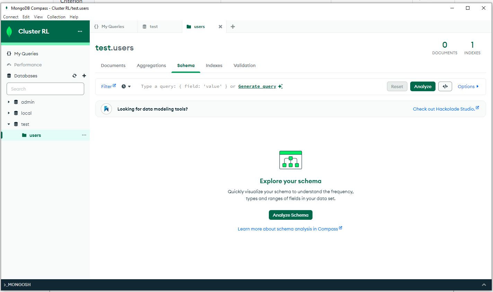

# Lab 04 - Mongoose Validation
Create a Node.JS, Express, MongoDB, Mongoose application that has the following deliverables

## Instructions
1. Create a Node.JS project 
2. Add all the relavant packages, mongoose and express dependancies
3. Add the UsersData.json file to your project
4. Create UserSchema with the following
    - All fields are Mandatory
    - username field must have a length >= 4
    - Allow only valid email addresses
    - Allow only alphabets and space while entering city name
    - Allow only valid web URL address (http or https is valid)
    - Zip code format must be like 12345-1234 (DDDDD-DDDD, D = digit)
    - Validate phone format like 1-123-123-1234 (D-DDD-DDD-DDD, D = digit)

# Screenshots
I think I routed the API's and created proper POST calls my mongoDB tables and schema weren't being accepted.

as you can see from the output the Schema objects weren't being accepted

Console outputs show that the mongoDB server is connected and the app.js is running on port 3000

So this shows that the database has been created but the schema or tables were not generated as well as any users :c